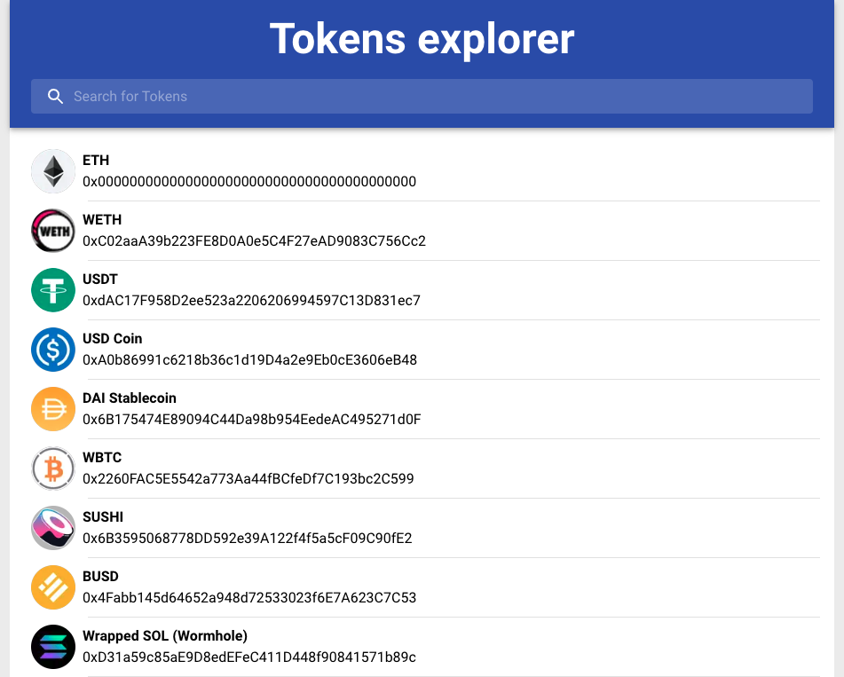
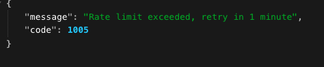
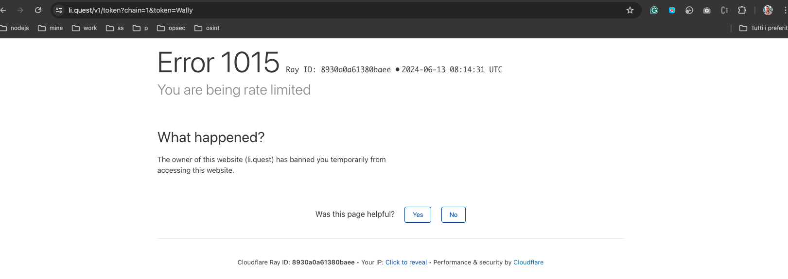
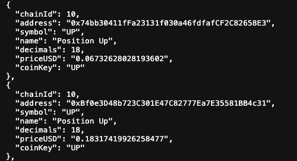
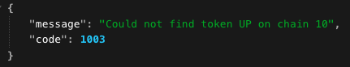
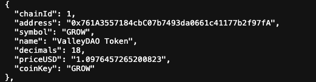
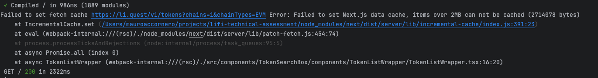
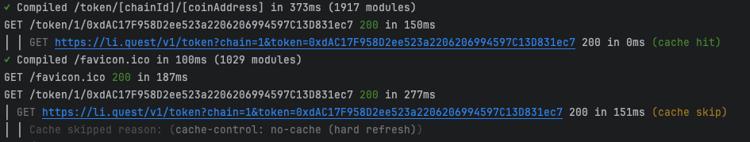
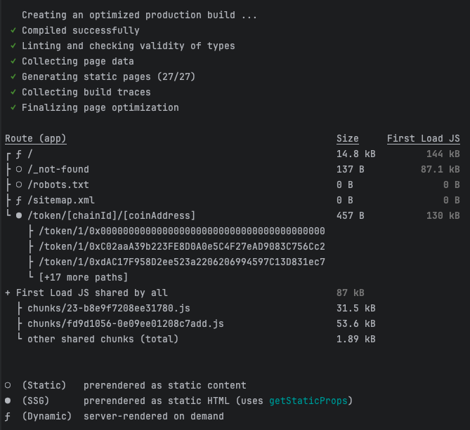
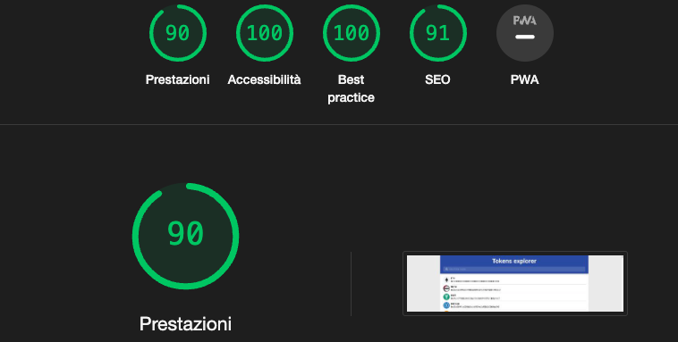

# LI.FI. Frontend technical assessment

## Before start

This project was created with Node 20.13.1 and npm 10.5.2.
Please use [Node.js LTS with nvm](https://nodejs.org/en/download/package-manager)

This application was made with [Next.js 14.2.3](https://nextjs.org/)

Here you can find a [quick demo](https://prp-lifi.vercel.app/) (it's a free tier on Vercel with limited performance, sometimes a token detail can return a 404 if the LI.FI API return a 429 for reaching the rate limit )


## Getting Started

Install dependencies

```
npm ci
```

First, run the development server:

```
npm run dev
```

Open [http://localhost:3000](http://localhost:3000) with your browser to see the result.

You should see something like this on your browser, otherwise check the terminal for possible errors



## Tests

Run local test with [playwright](https://playwright.dev/) , actually all test runs on a dev build, without fixture.
For additional info check the scripts inside the package.json file and the playwright.config.ts file

```
npm run dev:test
```

## Pre commit checks

Before commit, lint, fix and type check the codebase. This command will audit production dependencies as wel.
For additional info check the scripts inside the package.json file

```
npm run pre-commit
```

## LI.FI API

This application retrieve and use data from LI.FI APi please check the [LI.FI API documentation](https://apidocs.li.fi/reference/welcome-to-the-lifinance-api).

### Endpoints

The application use three endpoints without API key:

1. Get all LI.FI supported chains [https://li.quest/v1/chains](https://li.quest/v1/chains)
2. Get all LI.FI supported tokens [https://li.quest/v1/tokens?chains=eth&chainTypes=EVM](https://li.quest/v1/tokens?chains=eth&chainTypes=EVM)
3. Get token details [https://li.quest/v1/token?chain=1&token=ETH](https://li.quest/v1/token?chain=1&token=ETH)

### API Limitations

The api has some limitations, for this reason the ISR for detail page was limited to 20 items.

from: src/app/token/[chainId]/[coinKey]/page.tsx
```
export async function generateStaticParams() {
    const tokens = await getAllTokens();
    // limit ISR to 20 pages
    return tokens.slice(0, 20).map((token) => {
    return {
        coinKey: token.coinKey,
        chainId: token.chainId.toString(),
    };
    });
}
```

this helps to reduce the build time as well.

Please be careful about increasing this number, if the rate limit is exceeded the LI.FI API will reply with a 429 error.



If the 429 error it's ignored the LI.FI API will apply a temporary ban 



### Token details and identifiers

1. The only unique identifier for tokens from the [tokens endpoint](https://li.quest/v1/tokens?chains=eth&chainTypes=EVM) it's the address. (example: Position Up token)

2. Using the [tokens endpoint](https://li.quest/v1/tokens?chains=10&chainTypes=EVM) to retrieve token details sometimes can lead to a [404 for token detail](https://li.quest/v1/token?chain=10&token=UP) (using the token address usually [give better results](https://li.quest/v1/token?chain=10&token=0x7859664c493F43FEB5c5002B333B583D2568D80D))


### Token Images

1. Token images are not always present [GROW token](https://li.quest/v1/token?chain=1&token=GROW) 

2. Some token have a logoURI but the url doesn't point to a valid image (ex TOMB token image return a 404) [TOMB token](https://li.quest/v1/token?chain=250&token=TOMB)
3. There are multiple cdn domains and paths for token logos, to avoid a manual update of Next.js config file wildcards were used. Please check the next.config.mjs file.

### Additional info

1. [Chains](https://li.quest/v1/chains) and [Tokens](https://li.quest/v1/tokens?chains=eth&chainTypes=EVM) endpoints will return EVM chains by default
2. [token detail](https://li.quest/v1/token?chain=1&token=ETH) can use both chain ID and Key for chain parameter and token key or address for token parameter. (I found less 404 using the chain id and token address)

## Cache

### Next.js Data cache limits

When retrieving data from LI.FI API, if an endpoint return a large amount of data it's possible to face a Data Cache error from Next.js. More info about the issue are available on this [Next.js discussion](https://github.com/vercel/next.js/discussions/48324)


At moment, we got this error when using:
1. [full tokens endpoint without additional parameter](https://li.quest/v1/tokens)
2. [tokens from chain with id 1](https://li.quest/v1/tokens?chains=1&chainTypes=EVM)

### Implemented solution

To avoid this error and get the most benefit form Next.js cache I decided to retrieve the smaller possible chunk of data from the API to cache most of the data.

1. For this reason the [chains endpoint](https://li.quest/v1/chains) it's used to retrieve all the supported chains info.
2. To get all tokens information, caching most of the result, the [tokens endpoint](https://li.quest/v1/tokens?chains=eth&chainTypes=EVM) it's use per single chain.
This will still give an error for [tokens from chain with id 1](https://li.quest/v1/tokens?chains=1&chainTypes=EVM) a custom logic it's used. It's not a solution but additional information about the api should be provided to improve this solution.

src/api/getChainTokens.ts
```
fetch(url, { cache: chainId === "1" ? "no-store" : "force-cache" })
```
3. All the token details page call the [token detail endpoint](https://li.quest/v1/token?chain=1&token=ETH) to cache on request

### Debug cache behavior

To check the cache behavior it's possible to run the app locally with

```
npm run dev
```

open the browser and try to refresh a page with (F5) or without cache (ctrl+f5) and check the cache log from terminal



## Main app features

### Tokens research

To offer the best performance when the final user search for a specific token the page was split in components with different responsibilities:

1. a client component with a text field to get the user input and send the query to the router as query string
2. a backend component to retrieve all the tokens
3. a nested client component to get the query from the router and the tokens data from the parent component to show the filtered results

To improve the rendering a useMemo hook it's used to memoized the filtered data and a virtualized rendering allow a smooth experience for the long list of tokens.

For this app [Virtua](https://github.com/inokawa/virtua) was used to virtualization. It offers an easy integration and configuration in alternative to [react-window](https://github.com/bvaughn/react-window).

For a better experience the [Suspense](https://nextjs.org/docs/app/building-your-application/routing/loading-ui-and-streaming#streaming-with-suspense) component was used to handle the UI while the data is loading.

### Token detail

The token detail page retrieve the token detail data from LI.FI API relying on ISR to offer a cached result to the user.

Using the build command it's possible to verify the page creation process



A back button allow the user to return to the main homepage.

For a better experience the [Suspense](https://nextjs.org/docs/app/building-your-application/routing/loading-ui-and-streaming#streaming-with-suspense) component was used to handle the UI while the data is loading.

## Mark favorite tokens feature

To add the ability to mark a token as favorite a custom hook it's used to manage the localStorage and add/remove tokens from the localStorage array.

To move favorite tokens on top the token filter inside TokenList component was updated.

As well the TokenItem now show a start that underline which tokens are marked as favorite.

### UI/UX

Material Ui it's used to create most of the UI. A basic theme it's present inside the app folder as some styled component for custom components.
The app have a basic responsive just to grant the user interaction but was not the higher priority.

### Seo

For SEO a robots.txt and sitemap.xml are dynamically generated by Next.js.
A single sitemap it's created, at moment theRE are  more than 16k tokens from LI.FI API, Google suggest to separate sitemaps to have [less then 55k urls](https://developers.google.com/search/docs/crawling-indexing/sitemaps/build-sitemap#general-guidelines)
Inside the robots.txt a disallow directive it's present but just to avoid indexing the demo app provided for this project.
To generate dynamic title and description [generateMetadata](https://nextjs.org/docs/app/api-reference/functions/generate-metadata) was used for token detail page

### Optimizations

To improve the general performance of the app a few refinements 
- Added [custom headers](https://nextjs.org/docs/app/api-reference/next-config-js/headers) to Next.js config file
- [Image component priority](https://nextjs.org/docs/app/building-your-application/optimizing/images#priority) only for the first 20 items
- Added [sharp](https://github.com/lovell/sharp) to improve images performance
- Link component use [prefetch](https://nextjs.org/docs/app/api-reference/components/link#prefetch) only for the first 20 items
- Used [transpilePackages](https://nextjs.org/docs/app/api-reference/next-config-js/transpilePackages) and [modularizeImports](https://nextjs.org/docs/architecture/nextjs-compiler#modularize-imports) in Next.js config file for Material UI
- Use LI.FI API data with small chunks to get the most benefits from cache

The average result from Lighthouse reports a good performance for the app




### Security

To improve the security for this application more information are required but as general discussion here are some point that could be improved:

1. How much can we trust the token image cdn? Which alternatives are available?
2. Can we define better CSP policies?
3. Which benefit can we get by adding the dependencies audit to the CI?
4. env file is not in .gitignore at moment it does not contain any sensitive info but in the future it could be removed and a env.example could provide info about the required env variables

### Tests

Playwright it's used for basic e2e tests and added as GitHub action to this repository.

To locally run test use:

```
npm run dev:test
```

At moment, test runs on a dev build of the app. This can be improved by adding a mock server for fixtures and test on a specific build.

## Troubleshoot

If something is not working or acting weird you can try one of the following steps

### Remove Next.js cache

This will delete Next.js cache to avoid inconsistent behaviors

```
rm -rf .next
```

### Reinstall dependencies

Delete dependencies folder and reinstall all dependencies

```
rm -rf node_modules
npm ci
```

### Recreate package-lock

Delete dependencies folder, reinstall all dependencies and recreate package-lock.json.
Some dependencies could receive minor updates.

```
rm -rf node_modules
rm -rf package-lock.json
npm i
```

### Check log files

Check tsconfig.tsbuildinfo or .next/trace files for more info about any issue

### Check Node.js pending processes

On your OS find and kill any pending Node.js process

